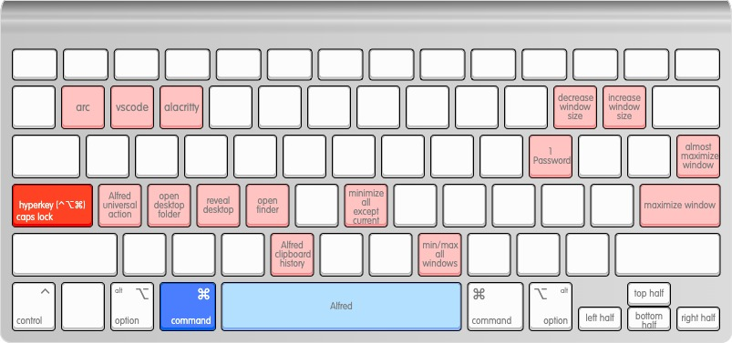

[keyboard shortcuts](http://www.keyboard-layout-editor.com/)

- general
  - [Arc](https://arc.net/)
  - [Visual Studio Code](https://code.visualstudio.com/)
  - [Alacritty](https://alacritty.org/)
  - [Dropbox](https://www.dropbox.com/downloading?os=mac)
  - [1Password](https://1password.com/downloads/mac/)
  - [AppCleaner](https://freemacsoft.net/appcleaner/)

- productivity
  - [Alfred 5](https://www.alfredapp.com/)
  - [Hyperkey](https://hyperkey.app/)
  - [Hammerspoon](https://www.hammerspoon.org/)
  - [Contexts 3](https://contexts.co/)
  - [MiddleClick](https://github.com/artginzburg/MiddleClick-Sonoma)
  - [Bartender](https://www.macbartender.com/Bartender5/)

- misc
  - [TopNotch](https://topnotch.app/)
  - [BatFi](https://app.gumroad.com/d/2fa184d3e33101e9b092db49751f4d9f)
  - [Shottr](https://shottr.cc/)

- dotfile manager: [yadm](https://yadm.io/docs/getting_started)

- zsh
  - [oh-my-zsh](https://ohmyz.sh/#install)
    - [zsh-autosuggestions](https://github.com/zsh-users/zsh-autosuggestions/blob/master/INSTALL.md#oh-my-zsh)
    - [fast-syntax-highlighting](https://github.com/zdharma-continuum/fast-syntax-highlighting#oh-my-zsh)

- [brew](https://brew.sh/)
  - [yadm](https://yadm.io/docs/getting_started)
  - [tmux](https://github.com/tmux/tmux/wiki)
  - [fzf](https://github.com/junegunn/fzf)
    - [fd](https://github.com/sharkdp/fd)