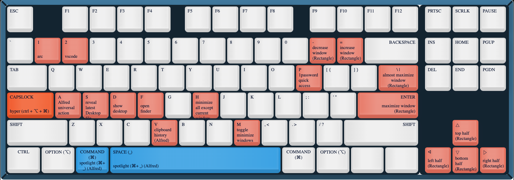

[keyboard map](https://archie-adams.github.io/keyboard-shortcut-map-maker/)


- apps
  - [Arc](https://arc.net/)
  - [Visual Studio Code](https://code.visualstudio.com/)
    - `Settings Sync` for profile
  - [Alacritty](https://alacritty.org/)
    - `.config/alacritty/alacritty.yml`
    - [themes](https://github.com/alacritty/alacritty-theme)
      - `.config/alacritty/themes`
  - [1Password](https://1password.com/downloads/mac/)
  - [Dropbox](https://www.dropbox.com/downloading?os=mac)
  - [AppCleaner](https://freemacsoft.net/appcleaner/)

- shortcuts
  - [Alfred 5](https://www.alfredapp.com/)
    - `Library/Application Support/Alfred/Alfred.alfredpreferences`
  - [Hyperkey](https://hyperkey.app/)
  - [Hammerspoon](https://www.hammerspoon.org/)
    - `.hammerspoon/init.lua`
  - [Contexts 3](https://contexts.co/)
  - [MiddleClick](https://github.com/artginzburg/MiddleClick-Sonoma)
  - [Rectangle](https://rectangleapp.com/)

- dotfile manager
  - [yadm](https://yadm.io/docs/getting_started)
    ```shell
    brew install yadm
    yadm clone https://github.com/jshu-git/dotfiles.git
    ```
    - `.aliases`
    - `.zshrc`
    - `.p10k.zsh`
    - `.tmux.conf`
    - `.vimrc`

- zsh
  - [oh-my-zsh](https://ohmyz.sh/#install)
    - [zsh-autosuggestions](https://github.com/zsh-users/zsh-autosuggestions/blob/master/INSTALL.md#oh-my-zsh)
      ```shell
      git clone https://github.com/zsh-users/zsh-autosuggestions ${ZSH_CUSTOM:-~/.oh-my-zsh/custom}/plugins/zsh-autosuggestions
      ```
    - [zsh-autocomplete](https://github.com/marlonrichert/zsh-autocomplete#manual-installation)
      ```shell
      git clone --depth 1 https://github.com/marlonrichert/zsh-autocomplete.git ${ZSH_CUSTOM:-~/.oh-my-zsh/custom}/plugins/zsh-autocomplete
      ```
    - [fast-syntax-highlighting](https://github.com/zdharma-continuum/fast-syntax-highlighting#oh-my-zsh)
      ```shell
      git clone https://github.com/zdharma-continuum/fast-syntax-highlighting.git ${ZSH_CUSTOM:-$HOME/.oh-my-zsh/custom}/plugins/fast-syntax-highlighting
      ```
    - [powerlevel10k](https://github.com/romkatv/powerlevel10k#oh-my-zsh)
      ```shell
      git clone --depth=1 https://github.com/romkatv/powerlevel10k.git ${ZSH_CUSTOM:-$HOME/.oh-my-zsh/custom}/themes/powerlevel10k
      ```

- extra
  - exclude Dropbox.app from spotlight search
